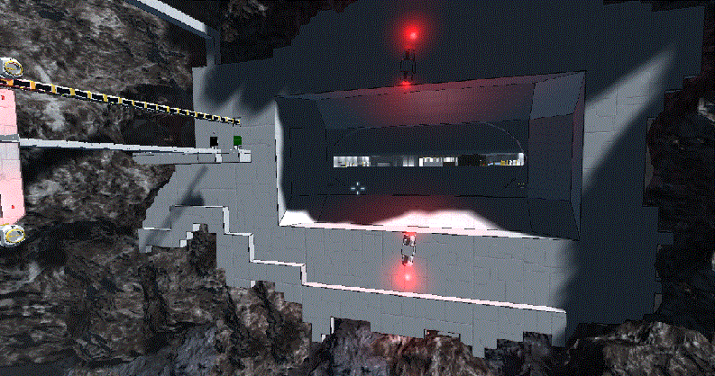
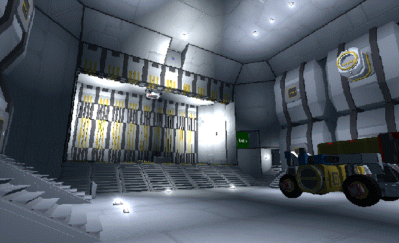
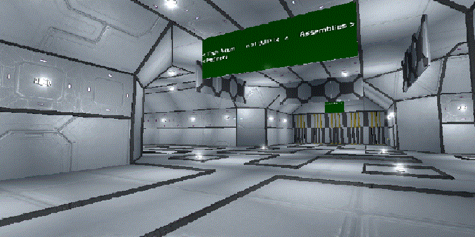

## Asteroido - large space station (platform)

This station is designed to be placed into Asteroid (or, even easier - to place asteroid around the base)

* TODO - share blueprint on steamworks

### Main features

* large base for those, who are claustrophobic
* automated doors, hangar and airtight gateways
* designed to fit all survival needs - oxygen, refineries, assemblies, welding and grinding (still in progress)
